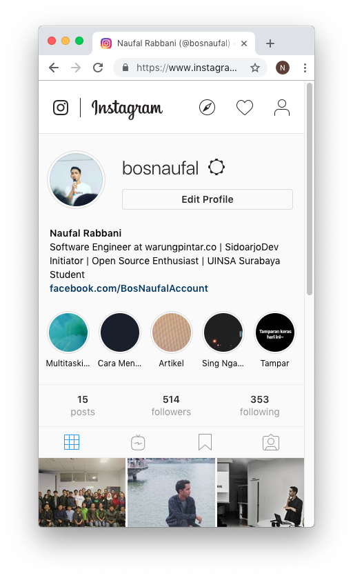
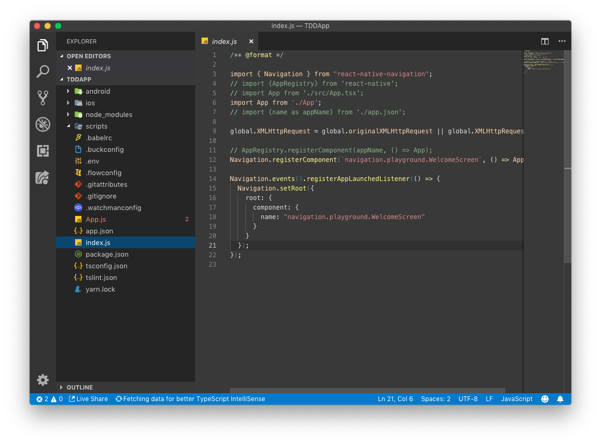
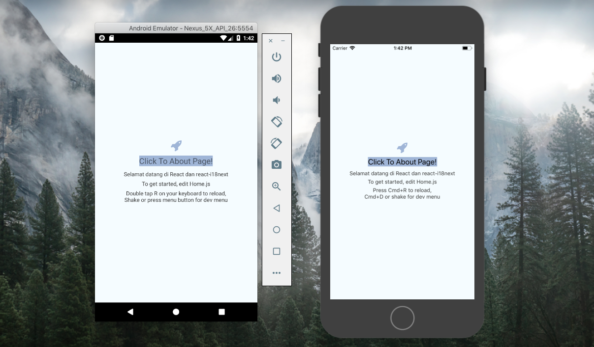

# Javascript Sabuk Putih

> "*Fundametal dahulu... baru React / Vue / Angular kemudian...*"

## Motivasi
Engineer Javascript adalah salah satu profesi yang paling dicari akhir-akhir ini. Ini terbukti banyak orang yang mengeluhkan bahwa sulit mencari Engineer dengan skill yang mahir. Sayangnya, resource pembelajaran bahasa pemrograman Javascript berbahasa Indonesia masih terbilang sedikit. Ini yang membuat perkembangan talent-talent baru menjadi lamban.

Terkadang kita terlalu fokus membahas topik-topik intermediate hingga advance. Sampai lupa bahwa masih banyak teman-teman kita yang ingin belajar mulai dari awal (banget). Dan bingung harus mulai dari mana.

Walaupun sudah banyak referensi pembelajaran yang bisa di searching di google. Bahasa dan "kemahiran browsing" masih menjadi kendala utama. Semoga mini ebook ini bisa menjadi salah satu modal awal untuk teman-teman yang ingin memulai belajar dan menekuni Javascript.

## Apa saja yang bisa dibuat dengan Javascript?

### Web App
Fungsi utama Javascript adalah membuat laman web menjadi lebih interaktif. Inilah sebab awal mula Javascript dibuat dan digunakan.

### Desktop App
Percaya atau tidak, VSCode adalah IDE / Code Editor yang dibuat menggunakan bahasa Javascript! VSCode adalah salah satu Code Editor yang paling ringan dan nyaman digunakan.

### Mobile App (Android / iOS)
Ingin membuat Aplikasi Mobile? Android? iOS? atau keduanya sekaligus? Gunakan Javascript! dengan bantuan react-native, kita bisa membuat aplikasi mobile dengan menggunakan Javascript.

### Server Side (Node JS)
Tidak hanya di klien, Javascript juga bisa dijalankan pada sisi server. Node JS adalah engine yang memungkinkan kita sebagai backend untuk menyediakan layanan / service rendering ataupun REST API dengan menggunakan bahasa Javascript!

> "Satu Bahasa Untuk Semua...."

## Gimana? masih mau menunda belajar? 
[Mulai Belajar Disini](https://bosnaufal.github.io/javascript-sabuk-putih/)

## Credits
Ebook ini dibuat oleh **Muhammad Naufal Rabbani**. Sangat mengharapkan  pertanyaan, kritik dan saran. Silahkan drop email di [bosnaufalemail@gmail.com](mailto:bosnaufalemail@gmail.com) atau hubungi langsung di telegram [@BosNaufal](https://t.me/BosNaufal) atau [facebook](https://facebook.com/BosNaufalAccount)

Semoga bisa bermanfaat dan menjadi modal awal untuk belajar React / Vue / Angular ataupun Node JS. Jangan segan untuk membagikan ebook ini....

Jadikan resource ini bermanfaat tanpa melanggar hak cipta. Ebook ini berlisensi [Attribution-NonCommercial 3.0 Unported (CC BY-NC 3.0)](https://creativecommons.org/licenses/by-nc/3.0/)
