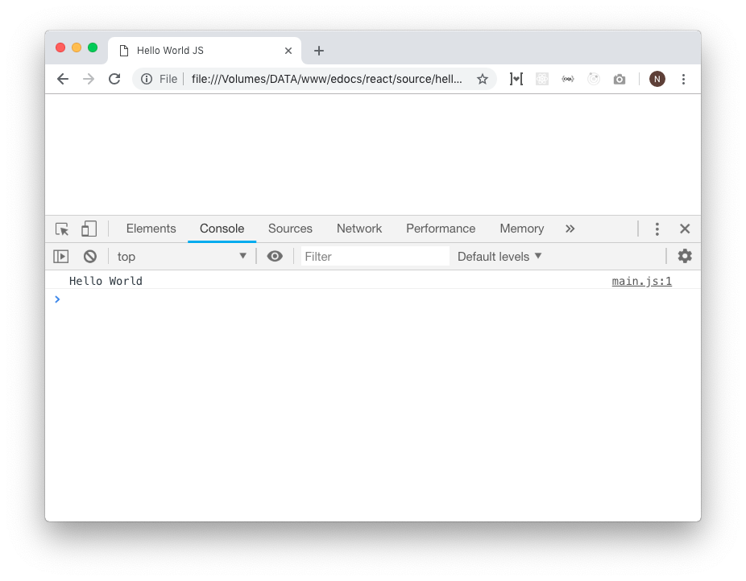

# Hello World

## Persiapan
Proses pengembangan aplikasi javascript memerlukan code editor atau IDE dan juga web browser. Teman-teman bisa memilih code editor dan browser kesayangan. Tapi tutorial pada buku ini menggunakan [VSCode](https://code.visualstudio.com/) sebagai code editornya dan [Chrome](https://www.google.com/chrome/) sebagai Web Browser. Untuk permulaan, Javascript akan dijalankan via browser supaya lebih mudah dan cepat.

## Membuat HTML File
Menjalankan javascript di browser memerlukan perantara berupa HTML file. Yang dimana HTML ini akan memanggil file `.js` lalu browser akan membaca file tersebut dan memprosesnya.

Buat folder `hello` lalu buka folder tersebut di VSCode, tambahkan beberapa file baru sebagai berikut:


Isi konten file `index.html` dengan snippet dibawah ini:

```html
<!-- file: hello/index.html -->

<!DOCTYPE html>
<html lang="en">
  <head>
    <title>Hello World JS</title>
  </head>
  <body>
    
  </body>
</html>
```

Lalu isi konten `main.js` dengan snippet dibawah ini:

```javascript
// file: hello/main.js

console.log("Hello World");
```

Jangan lupa untuk memanggilnya di file HTML yang telah dibuat. Tambahkan satu baris ini diatas `</body>`

```html
<script src="./main.js" type="text/javascript"></script>
```

## Jalankan di Browser
Saatnya menjalankan file HTML yang telah dibuat dengan cara menyeret (drag) file tersebut ke browser. Maka akan tampil laman putih bersih tanpa tulisan apapun.

Jangan khawatir, teman-teman cukup buka console chrome. Caranya adalah dengan klik kanan pada laman kosong tersebut, lalu klik `inspect`, klik tab `console`. Berikut hasilnya:



Dan selanjutnya, teman-teman bisa mengedit file `main.js` untuk mencoba ataupun mengikuti tutorial javascript pada buku ini.

## Kok Tulisan Doang?
Buku ini mengajak teman-teman yang sama sekali belum mengenal javascript untuk memahami **dasar fundamental javascript**. Jadi akan lebih banyak output via console. 

> "Yaah gak asik dong?"

Justru lebih gak asik lagi jika teman-teman mencoba untuk *Jump Start* tapi sama sekali tidak memahami syntax ini untuk apa, syntax itu untuk apa, cara kerja function, built-in method, dsb. 

Tak perlu khawatir, hanya butuh waktu sehari atau dua hari untuk menghabiskan buku ini. Sebagai modal mempelajari javascript lebih dalam lagi.

