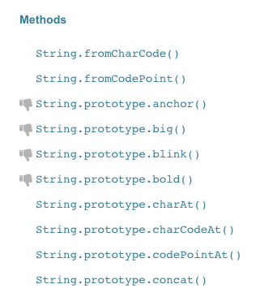

# Built-in Method

Pada tiap tipe data terdapat banyak method bawaan. Berikut adalah beberapa contoh method bawaan yang ada pada tiap tipe data:

## Cara membaca dokumentasi
Tapi sebelumnya, ada baiknya teman-teman tahu bagaimana cara membaca dokumentasi di MDN. Supaya teman-teman bisa explore lebih jauh apa saja method bawaan yang ada pada masing-masing tipe data. 

Misal tipe data `string`. Maka tinggal cari saja di google 
> "String Javascript MDN" 


Lalu klik link `String | MDN`. Maka akan masuk pada laman detail `string` pada situs MDN. Disana perhatikan sidebar sebelah kirinya. Terdapat list method yang ada pada tipe data `string` **lengkap**.



Mari coba klik method `String.prototype.concat` dan lihat detail penjelasannya. Disana terdapat deskripsi singkat, code playground untuk mencoba-coba dan ada keterangan detail lainnya.


Gimana sih cara pakainya? apa aja sih argumen yang diterima oleh method tersebut?. Teman-teman bisa melihat itu di bagian info syntax.


Jika dilihat dari gambar diatas, bisa disimpulkan jika method `concat` ini menerima banyak argumen dan argumennya berbentuk string. mulai dari string 1 sampai string ke - n (tak berbatas). dan di method tersebut akan mengembalikan (`return`) nilai yang berupa string hasil dari penggabungan (concat).

Contoh Penggunaan:

```javascript
let a = "a"
let b = "b"
let c = "c"
let d = "d"

let gabungan = a.concat(b, c, d)
console.log(gabungan) // log: "abcd"
```

Mari lanjutkan melihat sekilas contoh-contoh method bawaan yang ada pada tiap tipe data.


## String
`toLowerCase`, `toUpperCase`, `split`, `replace`, [dan lain-lain](https://developer.mozilla.org/en-US/docs/Web/JavaScript/Reference/Global_Objects/String#Methods).

```javascript
let namaBiasa = "nAuFal"

let namaKapital = namaBiasa.toUpperCase()
console.log(namaKapital) // log: "NAUFAL"

let namaLower = namaKapital.toLowerCase()
console.log(namaLower) // log: "naufal"

let stringToArray = namaKapital.split("")
console.log(stringToArray) // log: ["N", "A", "U", "F", "A", "L"]

let stringReplace = namaKapital.replace("A", "O")
console.log(stringReplace) // log: "NOUFOL"
```

> Refs: https://developer.mozilla.org/en-US/docs/Web/JavaScript/Reference/Global_Objects/String 


## Number 
`toFixed`, `toString`, [dan lain-lain](https://developer.mozilla.org/en-US/docs/Web/JavaScript/Reference/Global_Objects/String#Methods). 


```javascript
let angkaBiasa = 25
console.log(angkaBiasa) // log: 25

let angkaDesimal = angkaBiasa.toFixed(2)
console.log(angkaDesimal) // log: 25.00

let angkaString = angkaBiasa.toString()
console.log(angkaString) // log: "25"
```

> Refs: https://developer.mozilla.org/en-US/docs/Web/JavaScript/Reference/Global_Objects/Number 


## Array 
`push`, `splice`, `forEach`, `map`, dll.

```javascript
let arrBiasa = ["a", "b", "c"]
console.log(arrBiasa) // log: ["a", "b", "c"]

arrBiasa.push("d")
console.log(arrBiasa) // log: ["a", "b", "c", "d"]

arrBiasa.splice(1, 1)
console.log(arrBiasa) // log: ["a", "c", "d"]

arrBiasa.forEach((huruf) => {
  console.log(huruf)
})
/**
  log:
  "a"
  "c"
  "d"
**/

const arrBaru = arrBiasa.map((huruf) => {
  return huruf.toUpperCase()
})
console.log(arrBaru) // log: ["A", "C", "D"]
```

> Refs: https://developer.mozilla.org/en-US/docs/Web/JavaScript/Reference/Global_Objects/Array 

