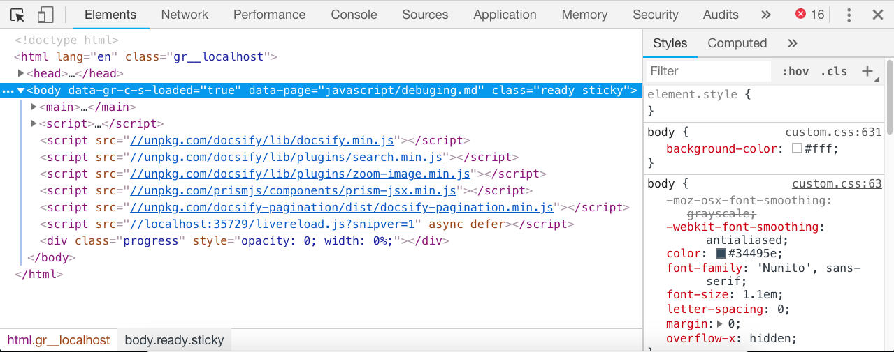
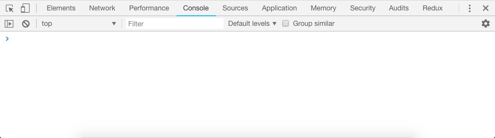
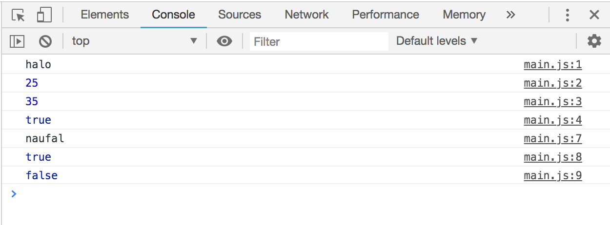

# Debuging In Javascript

## Web Console
Salah satu tool yang wajib dikuasai oleh seorang javascript developer adalah web console. Jadi harus akrab banget tuh sama yang namanya web console. Web console ini tidak perlu diinstall, karena sudah ada pada masing-masing browser. Tapi saya pribadi suka menggunakan browser chrome karena consolenya menurut saya sangat powerfull. belum lagi banyak extensions tambahannya. Untuk membuka web console cukup dengan klik kanan pada browser, lalu klik `inspect` element.



Kebetulan saya menggunakan chrome untuk proses develop sehari-hari dan begitulah penampakan web devtools saat setelah kita memilih inspect element. Nah pada bagian atasnya terdapat tab-tab mulai dari `Elements`,
`Network`, `Peformance`, `Console`, `Application` dll. Yang nantinya bakal sering kita gunakan adalah 5 tabs ini. Tapi untuk saat ini, mari kita coba klik tab `console` untuk membuka web console kita.




## Persyaratan
Sebelum lanjut ke bagian selanjutnya, pastikan teman-teman sudah tau bagaimana cara membuat dan membuka file HTML (`.html`) maupun Javascript (`.js`). Karena pembahasan tersebut tidak termasuk dalam konten dokumen kita kali ini. Tapi teman-teman bisa mencari referensi lain untuk mempelajarinya. Coba baca referensi berikut ini [MDN Dasar Javascript](https://developer.mozilla.org/id/docs/Learn/Getting_started_with_the_web/JavaScript_basics). Saya sering menggunakan MDN sebagai referensi untuk mencari atau fungsi-fungsi yang ada pada javascript karena penjelasannya yang singkat dan lengkap.

## Console Log
Cara paling mudah untuk melakukan debuging javascript adalah dengan melakukan `console.log()`. Yaitu proses menampilkan suatu nilai dari variable ke web console. Contohnya seperti ini


```javascript
// file: main.js

console.log("halo"); // log: "halo"
console.log(25); // log: 25
console.log((25 + 10)); // log: 35
console.log(true); // log: true

var nama = "naufal"
console.log(nama); // log: "naufal"
console.log(nama === "naufal") // log: true
console.log(nama !== "naufal") // log: false
```

saat kita menjalankan file javascript tersebut, maka yang muncul adalah seperti gambar dibawah ini



Nah dengan web console kita bisa melihat perubahan-perubahan pada variabel yang ada. Sehingga kita bisa tau letak kesalahan jika sewaktu-waktu aplikasi kita mengalami error. Pada kasus-kasus umum, `console.log()` digunakan untuk melihat hasil response dari `ajax` ke server, melihat props pada component, melihat state pada component, dll.