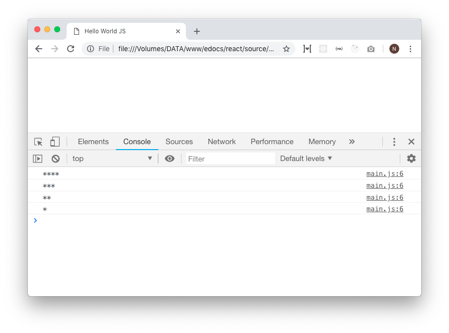

# Iterasi

Iterasi adalah sebuah sebuah aksi untuk melakukan eksekusi blok code secara berulang hingga terpenuhi suatu syarat tertentu. Dalam javascript ada banyak keyword yang digunakan untuk melakukan iterasi, beberapa diantaranya adalah `for`, `while`, dan `do while`.


## For
`for` adalah sintaks yang paling sering digunakan untuk melakukan iterasi manual. Format penulisannya adalah sebagai berikut:

```javascript
for (definsi variabel awal;   syarat;   pengolahan variabel awal) {
  // Blok Code yang dijalankan saat iterasi berjalan
}
```

```javascript
for (let i = 0; i <= 5; i++) {
  console.log(i)
}

/*
  log: 
    0
    1
    2
    3
    4
    5
*/
```


```javascript
for (let i = 1; i <= 5; i += 2) {
  console.log(i)
}

/*
  log: 
    1
    3
    5
*/
```

> Iterasi bertingkat

```javascript
// Untuk membuat barisan bintang...

for (let i = 0; i < 4; i++) {
  let baris = ""
  for (let k = i; k < 4; k++) {
    baris += "*"
  }
  console.log(baris)
}

/*
  log: 
    ****
    ***
    **
    *
*/
```




## While
`while` secara garis besar sama dengan `for` hanya saja syarat dari iterasi diatur secara manual. Berikut format penulisannya.

```javascript
while (syarat) {
 // blok kode yang dijalankan saat iterasi
}
```

Semisal ingin menampilkan deretan angka dari x sampai y

```javascript
const batasAwal = 5
const batasAkhir = 10
let angkaSaatIni = batasAwal

while (angkaSaatIni <= batasAkhir) {
  console.log(angkaSaatIni)  

  // Jangan lupa ini
  angkaSaatIni++
}

/*
  log: 
    5
    6
    7
    8
    9
    10
*/
```


## Do While
`do while` adalah bentuk lain penulisan `while`. Jadi sebenarnya antara `while` dan `do while` sama saja, penulisannya yang berbeda.

```javascript
do {
  // blok kode yang dijalankan saat iterasi
} while (syarat) 
```

Semisal ingin menampilkan deretan angka dari x sampai y

```javascript
const batasAwal = 5
const batasAkhir = 10
let angkaSaatIni = batasAwal

do {
  console.log(angkaSaatIni)  

  // Jangan lupa ini
  angkaSaatIni++
} while (angkaSaatIni <= batasAkhir)

/*
  log: 
    5
    6
    7
    8
    9
    10
*/
```


