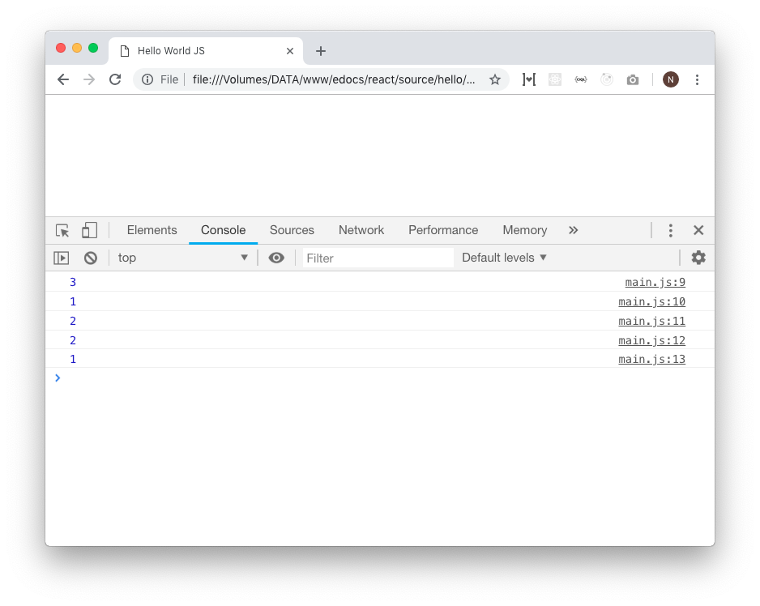

# Operator

Operator biasanya digunakan untuk proses aritmatika, perbandingan maupun penentuan logika pada sintaks kondisional.


## Operator Aritmatika
Operator ini digunakan untuk proses hitung-menghitung. Operator ini yang paling mudah dipahami karena sudah banyak ditemui waktu pelajaran matematika di bangku sekolah.

```javascript
const penjumlahan = 1 + 2
const pengurangan = 2 - 1
const pengalian = 2 * 1
const pembagian = 4 / 2

// Biasa disebut modulus:
const sisaPembagian = 5 % 2

console.log(penjumlahan) // log: 3
console.log(pengurangan) // log: 1
console.log(pengalian) // log: 2
console.log(pembagian) // log: 2
console.log(sisaPembagian) // log: 1
```



## Operator Aritmatika Tambahan

```javascript
let angka = 1
angka++
console.log(angka) // log: 2
angka++
console.log(angka) // log: 3
```

```javascript
let angka = 1

angka += 2 
console.log(angka) // log: 3

angka += 3 
console.log(angka) // log: 6
```

```javascript
let angka = 6

angka -= 1 
console.log(angka) // log: 5

angka -= 5 
console.log(angka) // log: 0
```


## Operator Perbandingan
Operator yang digunakan untuk mengecek suatu perbandingan. Biasanya digunakan untuk menghasilkan nilai balikan berupa `true` dan `false` yang nantinya akan digunakan pada sintaks kondisional.

| Operator | Nama |Keterangan |
|:--------:|:----------:|:----------:|
| == | Equal | Apakah nilai kiri **sama dengan** nilai kanan (tipe data tidak strict) |
| === | Strict Equal | Apakah nilai kiri **sama dengan** nilai kanan (tipe data harus sejenis untuk dianggap sama / `true`) |
| != | Not Equal | Apakah nilai kiri **tidak sama dengan** nilai kanan (tipe data tidak strict) |
| !== | Strict Not Equal | Apakah nilai kiri **tidak sama dengan** nilai kanan (tipe data harus sejenis untuk dianggap tidak sama / `true`) |
| < | Less Than | Apakah nilai kiri **kurang dari** nilai kanan |
| > | Greater Than | Apakah nilai kiri **lebih dari** nilai kanan |
| <= | Less Than Or Equal | Apakah nilai kiri **kurang dari atau sama dengan** nilai kanan |
| >= | Greater Than Or Equal | Apakah nilai kiri **lebih dari atau sama dengan** nilai kanan |

Penggunaan operator strict sangat disarankan untuk meminimalisir bug yang tak diinginkan.

```javascript
let kiri = 1
let kanan = "1"

console.log(kiri == kanan) // true (tidak strict, dianggap sama walau tipe data berbeda)
console.log(kiri === kanan) // false (karena strict)

kiri = 2
kanan = 2
console.log(kiri == kanan) // true
console.log(kiri === kanan) // true

kiri = 1
kanan = "1"
console.log(kiri != kanan) // false (tidak strict, dianggap sama walau tipe data berbeda)
console.log(kiri !== kanan) // true
```

```javascript
let kiri = 2
let kanan = 5

console.log(kiri > kanan) // false
console.log(kiri < kanan) // true

kiri = 2
kanan = 2
console.log(kiri >= kanan) // true
console.log(kiri <= kanan) // true
```

## Operator Logika
Mirip dengan operator perbandingan, hanya saja fungsinya untuk menggabungkan 2 atau lebih kondisi menjadi 1.

| Operator | Nama | Keterangan |
|:--------:|:----------:|:----------:|
| && | AND | kondisi kiri **dan** kanan harus true |
| \|\| | OR | kondisi kiri **atau** kanan harus true |
| ! | Negasi / Kebalikan | Negasi pada nilai (Misal: `true` maka akan menjadi `false`) |

```javascript
// User roles
let isAdmin = true
let isManager = false

// Harus Admin DAN Harus Manager (tidak boleh hanya salah satu)
console.log(isAdmin && isManager) // false

// Boleh Admin ATAU Manager (boleh salah satu)
console.log(isAdmin || isManager) // true

const userRole = "editor"
const isEditor = userRole === "editor"

// BUKAN editor boleh masuk
if (!isEditor) {
  console.log("Boleh masuk")
} else {
  console.log("Tidak Boleh masuk")
}

// log: Tidak boleh masuk (karena dia editor)
```


## Ternary Operator
Ternary operator adalah operator untuk mendefinisikan suatu nilai secara kondisional. Ini sangat penting dan sangat sering digunakan. Misal pada conditional rendering di react / vue / angular / dkk. Jadi wajib paham!

> Format Penulisan

```javascript
kondisi ? nilai jika true : nilai jika false
```

```javascript
const babTerbaca = 5
const totalBab = 5

const pesan = babTerbaca === totalBab ? "Buku Selesai Dibaca" : "Baca Terus Oy!"

console.log(pesan) // log: Buku Selesai Dibaca
```

Bagaimana cara membaca ternary operator tersebut? Jadi ternary operator diawali oleh kondisi

```javascript
// Ini adalah kondisi pada ternary Operator
babTerbaca === totalBab ?
```

Jika nilainya benar / `true`, maka nilai yang dibalikkan atau `return` adalah nilai yang berada di sebelah kiri. Sedangkan jika salah, maka nilai yang di `return` adalah nilai yang sebelah kanan

```javascript
// KIRI                   // KANAN
"Buku Selesai Dibaca" : "Baca Terus Oy!"
```