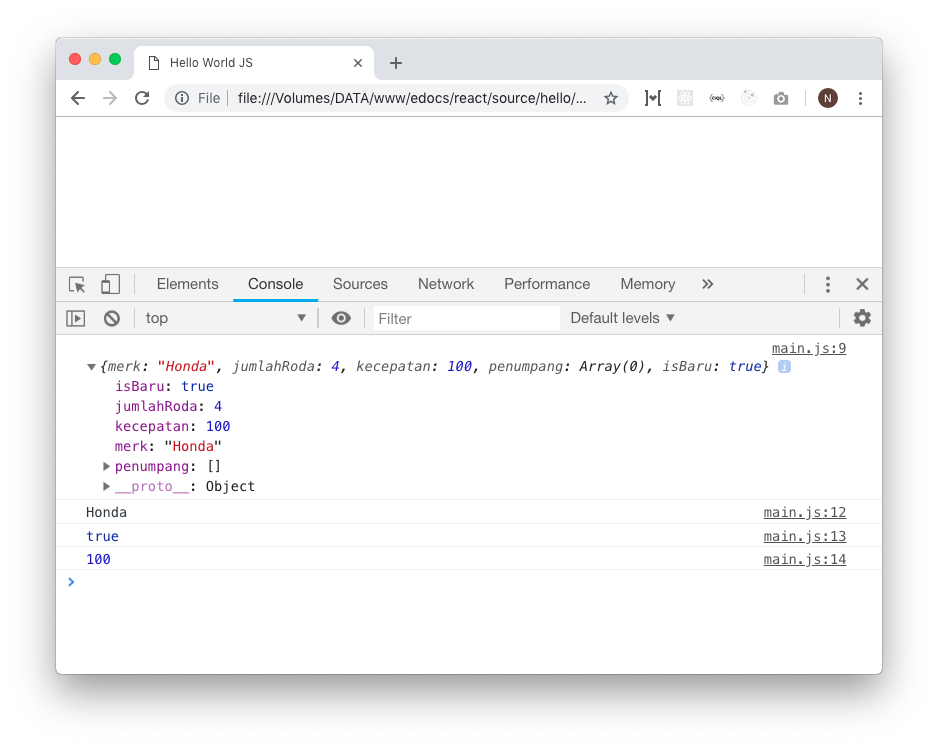

# Tipe Data

Pada javascript terdapat beberapa jenis tipe data dasar, yaitu: `string`, `number`, `boolean`, `array`, `object`, dan `function`. Mari ulas satu-persatu.

## String
String adalah variabel yang berisi text. Biasanya digunakan untuk menyimpan nama, konten, dll. Cara mendefinisikan variable string adalah dengan cara  membungkusnya dengan quotes (`"`/`'`).

```javascript
let string1 = "halo"
let string2 = 'hai'

let salah = salah // error
```

Variable string satu bisa dikombinasikan dengan variable string yang lain. dengan menggunakan tanda `+` atau dengan menggunakan ES6 template literal. Berikut contohnya:

```javascript
let string1 = "halo"
let string2 = 'hai'

// Concat biasa
let gabunganBiasa = string1 + " " + string2; 
console.log(gabunganBiasa) // log: "halo hai"

// ES6 template literal
let gabunganES6 = `${string1} ${string2}`
console.log(gabunganES6) // log: "halo hai"
```

Disarankan untuk menggunakan penggabungan ES6 dengan menggunakan tanda backtick ( ` ).


## Number
Number adalah variabel yang berisi angka yang nantinya bisa diolah dengan operasi-operasi matematika. Jadi nilainya haruslah angka.

```javascript
let number1 = 25
let number2 = 04 // error angka tidak valid
let number3 = 4
let number4 = 2000
let number5 = 2000 + 18
let total = number4 / number3 + number1

let decimal = 20.2
let decimalJuga = 40.24
```

## Boolean
Boolean adalah variable yang nilainya `true` dan `false`. variable boolean biasa digunakan untuk melakukan conditional (`if` / `else` / `elseif`).

```javascript
let isTrue = true
let isFalse = false
```

Ada beberapa nilai lain yang dianggap sebagai `true` maupun `false`. Mari melakukan percobaan untuk mengecek apakah variable ini bernilai `true` ataupun `false`.

```javascript
function check(value) {
  if (value) console.log("bernilai true")
  else console.log("bernilai false")
}

check(true) // log: "bernilai true"
check(false) // log: "bernilai false"

check(1) // log: "bernilai true"
check(0) // log: "bernilai false"
check(-1) // log: "bernilai false"

check("text") // log: "bernilai true"
check("") // log: "bernilai false"

check({}) // log: "bernilai true"
check([]) // log: "bernilai true"
check(check) // log: "bernilai true"

check(NaN) // log: "bernilai true"
check(infinity) // log: "bernilai true"
check(undefined) // log: "bernilai false"
check(null) // log: "bernilai false"
```

Jika dikelompokkan, maka ada beberapa nilai variable yang dianggap sebagai `true` dan ada yang `false`.

```javascript
/**
  Kelompok True
**/
check(true) // boolean true
check(1) // angka lebih dari 0
check(NaN) // NaN
check(infinity) // infinity
check("text") // string yang memliki panjang lebih dari 1 karakter
check({}) // Object kosong
check([]) // Array kosong
check(check) // function dianggap true


/**
  Kelompok False
**/
check(false) // boolean false
check(0) // angka 0
check(-1) // angka kurang dari 0
check("") // string kosong
check(null) // null
check(undefined) // undefined
```

jadi kelompok tersebut bisa digunakan untuk menentukan eksekusi kode pada syntax conditional yang ada.


## Object
Object adalah variable yang bisa menampung beberapa nilai sekaligus dalam bentuk field. penulisannya diawali dengan kurung keriting (`{}`) , dan tiap fieldnya dipisahkan oleh koma.

> Format Penulisan Object

```javascript
let namaVariable = {
  field: "value"
}
```

```javascript
let obj = {
  merk: "Honda",
  jumlahRoda: 4,
  kecepatan: 100,
  penumpang: [],
  isBaru: true,
  doThing() {
    console.log("Function di dalam object")
  }
}

console.log(obj)
// Akan menampilkan semua data pada variable obj

console.log(obj.merk) // log: "Honda"
console.log(obj.isBaru) // log: true
console.log(obj.kecepatan) // log: 100
obj.doThing() // log: Function di dalam object
```




Object ini bisa juga nested atau bertingkat. Jadi memungkinkan untuk memiliki object di dalam object.

```javascript
let objekku = {
  user: {
    name: "Naufal",
    email: "emailaja@email.com",
  },
  level: "Admin",
}

console.log(objekku) // akan menampilkan object keseluruhan


console.log(objekku.user) // akan menampilkan object user di dalam variable objekku
console.log(objekku.user.name) // log: "Naufal"


// Pemanggilan menggunakan string
console.log(objekku["user"]) // menampilkan object user
console.log(objekku["user"]["name"]) // log: "Naufal"


// Pemanggilan menggunakan key variable
let key = "user"
console.log(objekku[key]) // menampilkan object user
console.log(objekku[key].name) // log: "Naufal"
```


## Array
Array adalah variable yang mampu menampung beberapa nilai variable dalam bentuk member. Hampir sama dengan object, hanya saja cara pemanggilan dan fungsi utamanya yang berbeda. Fungsi utama Array adalah untuk **kebutuhan looping**, jadi array bisa diiterasi. Berbeda dengan object yang tak bisa di iterasi secara langsung.

Cara menuliskan Array adalah dengan membungkus nilai-nilai yang ada menggunakan kurung kotak atau brackets (`[]`). Perlu dicatat, iterasi array dimulai dari 0 bukan 1. Jadi semisal ada seperti ini:

```javascript
let arrString = ["Naufal", "Faisal", "Rizky"]

console.log(arrString) // log: ["Naufal", "Faisal", "Rizky"]
console.log(arrString[0]) // log: "Naufal"
console.log(arrString[1]) // log: "Faisal"
console.log(arrString[2]) // log: "Rizky"
```

itu berarti terdapat 3 member dalam array, masing-masing member merupakan string. dan member ke-0 adalah `"Naufal"`, member ke-1 adalah `"Faisal"` dan member ke-2 adalah `"Rizky"`. Berikut adalah contoh-contoh yang lain:


```javascript
let arrString = ["Naufal", "Faisal", "Rizky"]
let arrNumber = [25, 4, 2000]

let arrObj = [
  { name: "Naufal", hobby: "read" },
  { name: "Faisal", hobby: "write" },
  { name: "Rizky", hobby: "play" },
]

// Multi dimensional
let userGroup = [
  ["Naufal", "Faisal"],
  ["Rizky"],
  ["Bejo", "Tejo"],
]

console.log(arrString) // log: ["Naufal", "Faisal", "Rizky"]
console.log(arrString[0]) // log: "Naufal"
console.log(arrString[1]) // log: "Faisal"
console.log(arrString[2]) // log: "Rizky"

console.log(arrNumber[0] + arrNumber[2]) // log: 2025

console.log(arrObj[0].name) // log: "Naufal"
console.log(arrObj[1].hobby) // log: "Write"
console.log(arrObj[2]) // log: { name: "Rizky", hobby: "play" }

console.log(userGroup[0]) // log: ["Naufal", "Faisal"]
console.log(userGroup[0][1]) // log: "Naufal"
console.log(userGroup[0][2]) // log: "Faisal"
console.log(userGroup[2][2]) // log: "Tejo"
```

Penguasaan Array ini sangat lah penting, karena akan digunakan untuk banyak proses terutama list rendering pada react / vue / angular / dkk. dan seringkali pula digunakan untuk proses pengolahan data. Buat teman-teman yang belum tahu apa itu iterasi, mari lihat contoh dibawah ini:

```javascript
let arrString = ["Naufal", "Faisal", "Rizky"]
let arrNumber = [25, 4, 2000]
let arrObj = [
  { name: "Naufal", hobby: "read" },
  { name: "Faisal", hobby: "write" },
  { name: "Rizky", hobby: "play" },
]

arrString.forEach((member, index) => {
  console.log(member, index)
})
// Maka akan tampil
// log: "Naufal", 0
// log: "Faisal", 1
// log: "Rizky", 2

let totalAngka = 0
arrNumber.forEach((angka, index) => {
  totalAngka = totalAngka + angka
})
console.log(totalAngka) // log: 2029

arrString.forEach((member) => {
  console.log(member.hoby)
})
// Maka akan tampil
// log: "read"
// log: "write"
// log: "play"
```

Ada pun contoh pengolahan data array yang sering digunakan, adalah `Array.map()` yaitu method dari tipe data Array yang digunakan untuk membuat array baru dengan value sesuai nilai yang dikembalikan (`return`). Contoh

```javascript
let users = [
  { name: "Naufal", hobby: "read" },
  { name: "Faisal", hobby: "write" },
  { name: "Rizky", hobby: "play" },
]

let arrBaru = users.map((user) => {
  return user.hobby
})
console.log(arrayBaru) // log: ["read", "write", "play"]


let usersWithId = users.map((user, index) => {
  user.id = index
  return user
})
console.log(usersWithId) 
/**
  log: [
    { id: 0, name: "Naufal", hobby: "read" },
    { id: 1, name: "Faisal", hobby: "write" },
    { id: 2, name: "Rizky", hobby: "play" },
  ]
**/
```