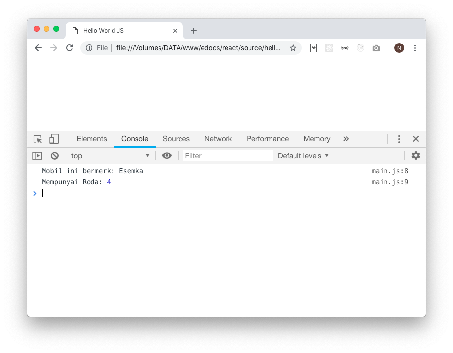

# Variable

## Pengertian
Variable adalah nilai-nilai pada program yang disimpan dengan suatu nama supaya mudah untuk digunakan lagi atau dipanggil secara berulang kali. Misal sebuah mobil, maka bisa dibuat variabel penunjang mobil seperti `jumlahRoda`, `merk`, `jenisBahanBakar`, `batasKecepatan`, dll.


<!-- ## Aturan Penulisan Variable -->

## Penamaan
Seperti bahasa pemrograman yang lain, pada Javascript, penulisan nama variable tidak boleh menggunakan spasi. Berikut adalah contoh definisi atau pembuatan variable pada javascript.

```javascript
// Proses mendefinisikan variable
let merk = "Esemka"
let jumlahRoda = 4
let jenisBahanBakar = "Solar"
let batasKecepatan = 100

// Contoh penggunaan variable
console.log("Mobil ini bermerk:", merk) // log: Mobil ini bermerk: Esemka
console.log("Mempunyai Roda:", jumlahRoda)  // log: Mempunyai Roda: 4
```

Coba copy paste snippet diatas ke file `main.js` lalu refresh browser atau drag ulang file `index.html`. Maka akan muncul console sebagai berikut:



## Keywords
Cukup mudah bukan? tapi ada aturan lain yang harus dipahami. Mendifiniskan variable bisa menggunakan beberapa jenis `keyword` diantaranya adalah `var`, `let`, dan `const`. Lantas apa perbedaanya?

|        Batasan        |        var        |  let   | const  |
| :-------------------: | :---------------: | :----: | :----: |
| Bisa diubah (Mutable) |       bisa        |  bisa  | tidak  |
|        Lingkup        | global (per file) | scoped | scoped |

Berikut adalah contoh penggunaannya

```javascript
// Contoh Penggunaan
var nama = "Joko"
let umur = 21
const gender = "laki-laki" 

console.log("nama:", nama) // log: nama: Joko
console.log("umur:", umur) // log: umur: 21
console.log("gender:", gender) // log: gender: laki-laki
```


## Mutasi / Perubahan Nilai
Variable yang telah didefinsikan tidak boleh didefinisikan lagi tapi boleh diubah nilainya. Misal:

```javascript
// Contoh Penggunaan
var nama = "Joko"
let umur = 21
const gender = "laki-laki" 

// Pengubahan
nama = "Siti" // no error
umur = 23 // no error

// Perhatikan!
gender = "perempuan" // Uncaught TypeError: Assignment to constant variable.
// Error: karena const tidak boleh diganti nilainya
```

Contoh salah ketika variabel didefinisikan ulang.

```javascript
let adik = "Faisal"
adik = "Baru" // No error

let nama = "Naufal"
let nama = "Baru" // Error: Uncaught SyntaxError: Identifier 'nama' has already been declared
// Error karena variable nama didefinisikan ulang
```


## Definisi melalui operasi
Variable juga bisa didefinisikan dari hasil suatu operasi.

```javascript
let total = 10 + 15
console.log(total) // log: 25


let beratBadan = 60
let tinggiBadan = 170
let isIdeal = (tinggiBadan - beratBadan) === 110

// untuk mengecek apakah ideal atau tidak
console.log(isIdeal) // log: true
```


## Lingkup Variable
Tiap Variable memiliki scope atau lingkup jangkuannya masing-masing. sampai berapa jauh variable itu bisa diakses. Berikut adalah contoh batas scope pada suatu variable. 

> Variable dari luar function bisa diakses karena masih dalam satu scope

```javascript
let merk = "Esemka"

function aksesVariableLuar() {
  console.log(merk)
}
aksesVariableLuar() // log: "Esemka"
console.log(merk) // log: "Esemka"
```


> Selama variable bukan lah constanta (`const`), maka bisa diganti dari lingkup yang lebih dalam

```javascript
let merk = "Esemka"
function ubahVariableLuar() {
  merk = "Esempe"
  console.log(merk)
}
ubahVariableLuar() // log: "Esempe"
```


> Variable yang ada di dalam function hanya bisa diakses pada scope function saja

```javascript
function cekBahanBakar() {
  let jenisBahanBakar = "Solar"
  console.log(jenisBahanBakar)
}
cekBahanBakar() // log: "Solar"

console.log(jenisBahanBakar) // error: Uncaught ReferenceError: jenisBahanBakar is not defined
```


> Boleh mendefinsikan variable dengan nama `jenisBahanBakar` walaupun telah ada nama variable `jenisBahanBakar` sebelumnya. Ini karena lingkup yang berbeda, jadi boleh-boleh saja namanya sama asalkan lingkupnya berbeda


```javascript
let merk = "Esemka"

function cekBahanBakarAwal() {
  let jenisBahanBakar = "Solar"
  console.log(jenisBahanBakar)
}

function cekBahanBakarLagi() {
  let jenisBahanBakar = "Dex"
  console.log(jenisBahanBakar)
}

cekBahanBakarLagi() // log: Dex
cekBahanBakarAwal() // log: Solar
```

> Variable `merk` yang diatas dan variable `merk` yang dibawah, memiliki scope yang sama akan tetapi karena yang dibawah berada di dalam scope function, maka boleh mendefinisikan ulang variabel merk (dengan catatan scopenya lebih dalam)

> **TAPI SANGAT TIDAK DISARANKAN MENGGUNAKAN NAMA VARIABEL YANG SAMA DALAM SATU SCOPE**


```javascript
let merk = "Esemka"

function definisiUlang() {
  let merk = "Esteem"
  console.log(merk)
}

definisiUlang() // log: Esteem
console.log(merk) // log: Esemka
```

